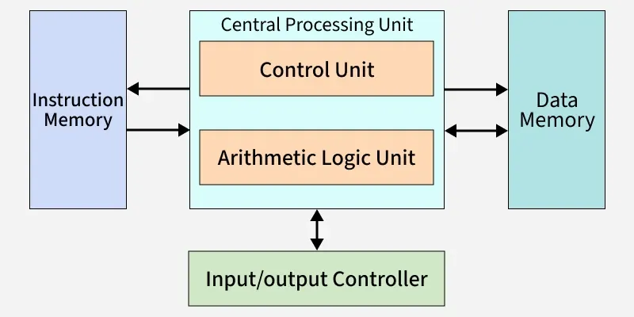
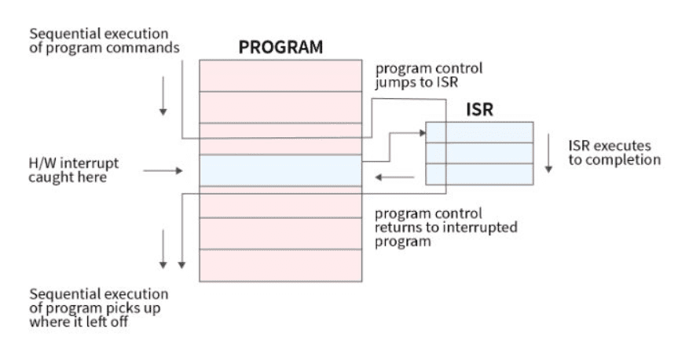
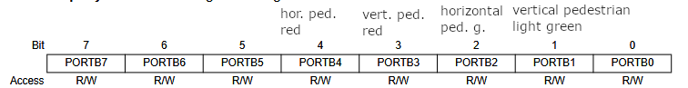
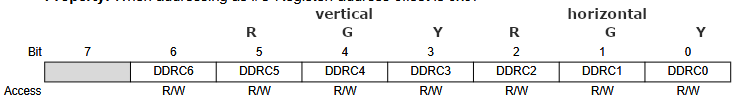
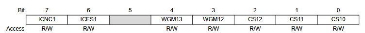
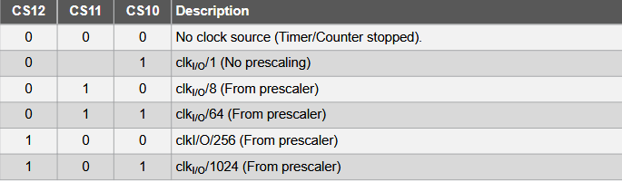

# Interrupt-Driven Traffic Controller in Bare-Metal C
*This project simulates a regular 4-way intersection controlled by traffic lights. It operates using an FSM (Finite-State Machine), and CPU timer interrupts by configuring the registers of an ATmega328P inside an Arduino.*
## Goal
The main goal of the project is for me to learn more about how microcontrollers work under all the abstractions done by the standard Arduino library. Rather than using for example `digitalWrite()` to light an LED I use bitwise operators like: `PORTB ^= (1 << 1)` to modify the pin's corresponding register.  
A secondary goal is to learn how to read Hardware Block Diagrams and technical documentation of a microcontroller.  
This document assumes a beginner-level knowledge of C so programming language syntax/semantics will not be explained.  
The project itself is quite beginner level in its design and software (no complicated functions or library usage) but for a beginner the challenges reveal themselves in the new concepts which the project touches upon but does not go in depth.
## AI usage
AI was only used to explain certain inner workings of the microcontroller and for the formatting of this document. The text is written by myself AI; only advised in its structure and helped me correct grammatical errors.
## Basic terminology/paradigms:
- **Microcontroller**: Microcontrollers (like the ATmega328P) are CPUs designed to execute simple automation tasks. They differ from CPUs found in your computer in the way they are desgined to operate namely that they use the [Harvard Architecture](https://www.geeksforgeeks.org/computer-organization-architecture/harvard-architecture/) (or its modified versions).

- **Crystal oscillator**: For our purposes the crystal oscillator is the part of the circuit that provides a stable frequency (i.e a rhythm) for the CPU's timer. The Arduino Uno includes a 16 Mhz oscillator.
- **Timers**: The timer(s) is the most important part of a microcontroller. It counts the cycles of the oscillator and by configuring its and its corresponding registers (specifically the **prescaler** bit) we can time the actions (in our case with interrupts) of the microcontroller. 
- **Prescaler**: As mentioned this is what we use to reduce the "counting" of the timer. It uses **hardware** integer division as to not slow the program down.
- **Interrupts**: Interrupts are originally designed to handle unexpected events while the processor is handling regular tasks. But in our case we can use it to create an FSM where each block is a state in which the lights are. The interval in which interrupts fire depends on:
    1. (**Prerequisite**) Whether we have enabled interrupts in the timer's register configuration.
    2. How we configured the timer in the sense that how many cycles it needs to count a "tick".

The biggest advantage of interrupts that they as mentioned work **alongside** the processor while for example the `delay()` function of the Arduino library makes the processor itself count to the given microseconds.  
*(You might notice that for this project it wouldn't matter whether we use delays or interrupts but still it is better practice not to make the CPU intentionally "dumber".)*
- **Memory**: In order to understand how we manipulate the pins on an Arduino just by manipulating bits we have to understand how memory works differently on a microcontroller compared to a regular pc (which I assume will assume you have a basic understanding of). Here we discuss how the "**Data memory**" box on the Harvard architecture diagram works by listing the different memory types and their functions:  
    1. **Registers** (inside the CPU): They work basically like the registers inside the pc. They fetch variables from the SRAM and perform basic operations.  
    2. **SRAM**: SRAM in practice is about as fast as the cache inside a regular computer. Thus it can be divided into two parts in terms of functionality:  
        - **MMIO** (Memory Mapped **I/O Registers**): These addresses are directly connected to (and thus mapped using macros) physical pins. This is how we for example control the current flowing/not flowing to these pins.  
        **Important**: When I refer to manipulating registers I am referring to the manipulation of these memory addresses!
        - **Standard SRAM** : This part works as regular RAM (i.e. storing variables).
    3. **Flash**: An immutable part of memory where the program code lives
    4. **EEPROM**: Small chunk of memory that stores configurations, essential firmware.
    - +1 **Bootloader**: Contains a permanent with the same name, it loads data from the USB port (on the Arduino).  

As mentioned the MMIO registers all have a corresponding macro. This allows us to write more readable code. For example instead of this:
```C
#define pin13 5
...
*(volatile uint8_t*)0x25 ^= (1 << pin13);
```
you can write this:
```C
#define pin13 5
...
PORTB ^= (1 << pin13); // same as the above example
```  
*(The Arduino pin configurations can easily be found online. If you want to find out to which register the pin is configured to look for the "Microcontroller's port label" (usually next to the Arduino IDE equivalent))*
- **Finite-State Machine**: The name is quite descriptive. The program has a certain number of **states** and the most important quality is that the program can only be in **one** state at a time. As mentioned we use interrupts to jump between states.
## Program structure
The program itself has 10 states and all of them follow the same naming convetion:  
`<direction>_<state>_<additional-description>`  
for example: `VERTICAL_GREEN`
- \<direction> refers to the direction we are controlling
- \<state> refers to the color of the light
- \<additional-description> is an optional state descriptor. It distinguishes between the 2 yellow states of a traffic light:
   - One where the light is turning green -> the red is on
   - One where the light is turning red -> red is off

## Pin configuration 
The pedestrian lights are found on the Arduino pins D9-D12. On the microcontroller these pins are controlled by PORTB.
  
The traffic lights are controlled by Arduino pins A0-A5. On the microcontroller these pins are controlled by PORTC.

## Initial setup and explanation
```C
void setup() {

  DDRC = (1 << 6)-1;
  DDRB = ((1 << 5)-1) ^ 1;
  
  PORTB = (1 << 4) | (1 << 1); 
  PORTC = (1 << 5) | 1; 
  
  TCCR1A = 0;
  TCCR1B = (1 << 3) | (1 << 2) | 1; 
  
  TIMSK1 = 2;
  TIMSK0 = 0; // built in arduino interrupts disabled
  OCR1A = 31249;
}
```  
#### Data Direction Register C/B (DDRB/C):  
These registers control exactly what the `pinMode()` function controls in the Arduino library. But rather than being able to set any pin to input/output we can only control the 8 pins specified in the documentation. The letter in the name of course corresponds to the port it controls (1 for output 0 for input).  
#### PORTB/C:
This is also pretty straightforward. We set up the initial start of out traffic lights. You can refer to the above configuration to see which lights are on/off. (All bits are set to 0 by default.)  
#### Timer/Counter Control Register (TCCR1A/B):  
This is where we actually start to control how the microcontroller behaves on the inside. 
These  registers are inseperable because simply there are so many configurations we can do for TIMER1 that we need 16 bits to set it up. In our case we set TCCR1A to 0 so we will not discuss it. But regarding TCCR1B:
  
What the current configuration means can be divided into 2 parts. As you know TCCR1B is set to 13 which means bits 3, 2 and 0 are set to 1. WGM stands for Waveform Generation Mode. For our purposes by setting WGM12 to 1 we basically make it so that when our TCNT1 (or TimerCount) reaches the specified in OCR1A the timer fires an interrupt and resets.  (You can read more about the WGM modes in the official docs)  
CS10-12 configure how many cycles the timer needs before it counts a "tick".
  
In summary now we configured our timer so that we can measure time upto ~ 4.2 seconds.  
*(This is how the math works: 16 000 000 Hz / 1024 = 15625 then our timer can count up to 65535 (2^16 - 1) so 65535 / 15625 = 4.19 seconds)*  
#### Timer/Counter 1 Interrupt Mask Register (TIMSK1)  
This register controls whether or not an interrupt fires when the counter reaches the value specified by OCR1A (or other registers but in our case OCR1A).  
#### Output Compare Register (OCR1A)  
The value we give it is the ceiling up until which TCNT1 counts, reaching it and then raising the Output Compare A Match Flag (OCF1A) (`TIMER1_COMPA_vect` in code).  
## Code
As mentioned the C code itself will not be explored so we will only touch on microcontroller specific code and minor design choices.  
- `ISR(TIMER1_COMPA_vect)`: As said the states are traversed by interrupts. `ISR()` saves the current state, executes the switch and finds the next state.
- The `OCR1A` changes: Because not all lights are on for the same time the code changes the counter's ceiling based on arbitrary taste.
- The "blinking" phases: In Hungary green pedestrian lights blink to signal people not to start crossing anymore. Here the ligth blinks 3.5 times to simulate this (3.5 so it ends on being off).